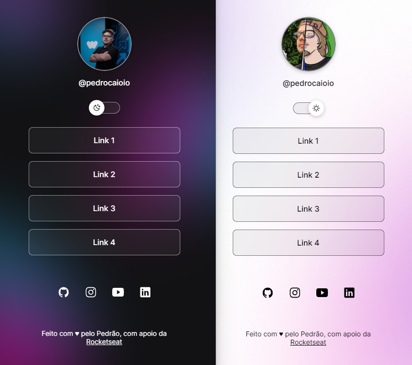

<h1 align="center"> DevLinks </h1>

 

## 💻 Projeto

O DevLinks é um agregador de links para usar como cartão de visitas online.

 

## 🚀 Tecnologias

Esse projeto foi desenvolvido com as seguintes tecnologias:

- HTML e CSS
- JavaScript
- Git e Github
- Figma

 

## 💳 Créditos

- <a href="https://rocketseat.com.br" target="_blank">Rocketseat</a>

 

## ©️ Licença

Esse projeto está sob a licença MIT.

 

  

